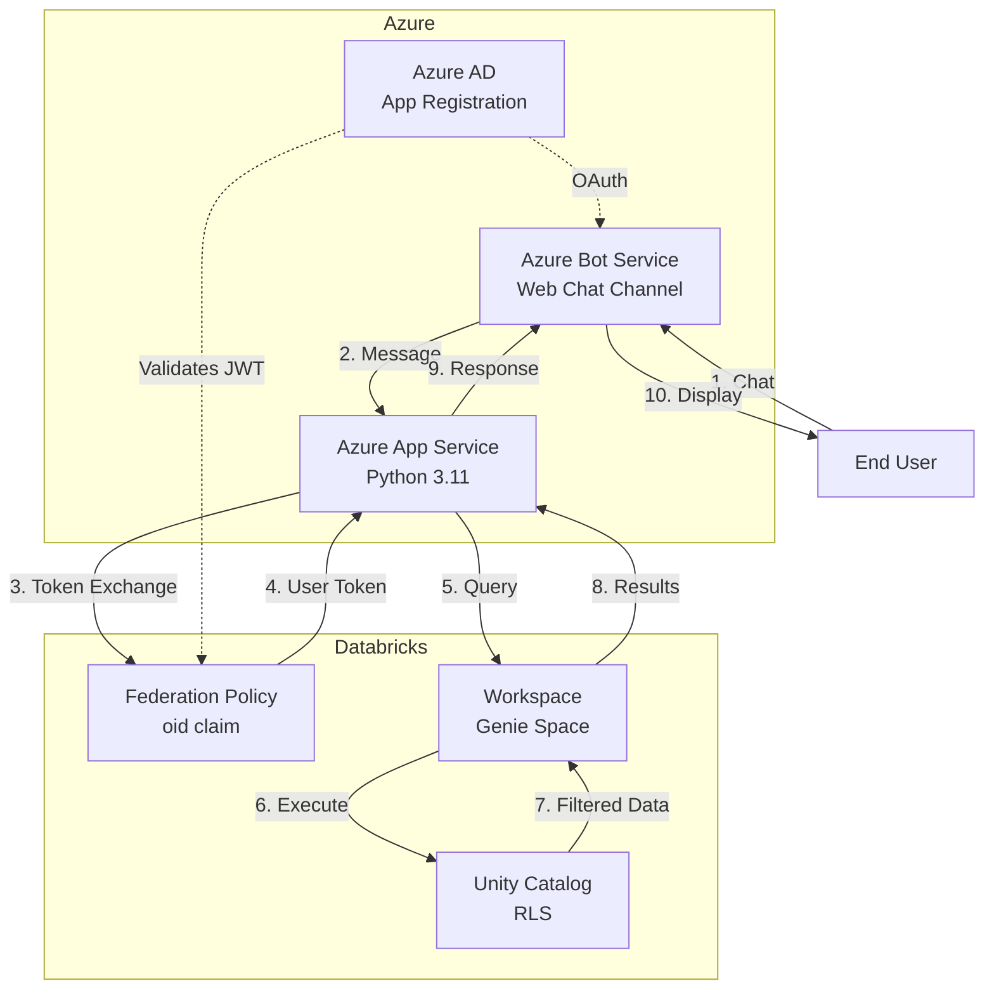
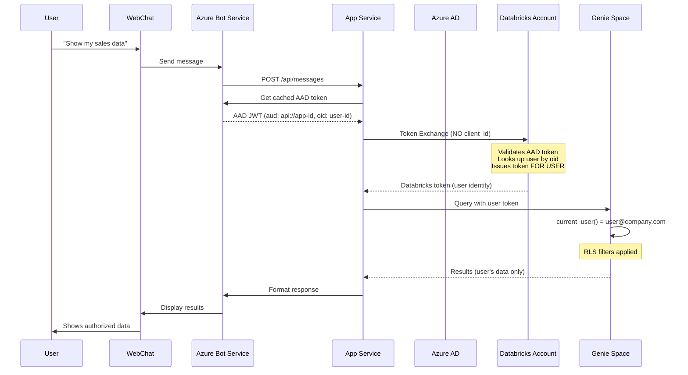

# Complete Implementation Guide

**Deployment Target:** Web Chat Bot with Row-Level Security  
**Last Updated:** January 2026

---

## What This Guide Builds

This guide walks you through deploying a conversational AI interface that enables users to query Databricks Genie through Microsoft Teams Web Chat while **preserving per-user Row-Level Security (RLS)**.

**Key Features:**
- Natural language queries via Web Chat
- User identity preservation for Unity Catalog RLS
- Automatic chart generation
- Conversation management
- Enterprise-grade security and monitoring

**The Critical Innovation:**

When a user asks "Show me my sales data," the system:
1. Exchanges their Azure AD token for a Databricks token **preserving their identity**
2. Executes the query **as that specific user**
3. Unity Catalog RLS ensures they see **only their authorized data**

This is achieved through **Account-Level Token Federation** without using a service principal.

---

## Prerequisites

Before starting, ensure you have:

### Azure Requirements

- [ ] **Azure Subscription** with Owner or Contributor access
- [ ] **Azure AD Tenant** with Application Administrator privileges
- [ ] **Azure CLI** installed and configured (`az --version`)
- [ ] Access to create:
  - App Registrations
  - Bot Services
  - App Services
  - Key Vaults (optional)

### Databricks Requirements

- [ ] **Databricks Account** with Account Admin access
- [ ] **Databricks Workspace** with Unity Catalog enabled
- [ ] **Genie Space** created with data sources configured
- [ ] Ability to configure Federation Policies in Account Console
- [ ] Ability to enable Automatic Identity Management (AIM)

### Development Tools

- [ ] Python 3.11+ (for local testing)
- [ ] Git (for code deployment)
- [ ] Text editor or IDE

### Knowledge Requirements

- Basic understanding of Azure services
- Familiarity with Bot Framework concepts
- Understanding of OAuth 2.0 flows
- Basic SQL and Unity Catalog knowledge

---

## Architecture Overview



### Token Flow Sequence



### Deployment Flow

This guide follows these steps:

1. **Azure AD Setup** → Create App Registration with OAuth scopes
2. **Databricks Setup** → Configure Federation Policy for user identity
3. **Bot Service Setup** → Configure OAuth connection for SSO
4. **App Service Deployment** → Deploy Python bot application
5. **Testing** → Verify RLS works correctly
6. **Production Readiness** → Security and monitoring

---

## Step 1: Azure AD Configuration

### 1.1 Create App Registration

1. Navigate to **Azure Portal** → **Azure Active Directory** → **App registrations**

2. Click **New registration**

3. Configure the application:
   - **Name**: `genie-bot-obo-rls` (or your preferred name)
   - **Supported account types**: **Accounts in this organizational directory only (Single tenant)**
   - **Redirect URI**: Leave empty (will add later)

4. Click **Register**

5. **Save these values** (you'll need them later):
   - **Application (client) ID** → This becomes `MICROSOFT_APP_ID`
   - **Directory (tenant) ID** → This becomes `MICROSOFT_APP_TENANT_ID`

### 1.2 Create Client Secret

1. Go to **Certificates & secrets** → **Client secrets**

2. Click **New client secret**:
   - **Description**: `bot-secret`
   - **Expires**: 24 months (recommended)

3. Click **Add**

4. **Copy the secret value immediately** → This becomes `MICROSOFT_APP_PASSWORD`
   
   ⚠️ **Important:** The secret value is only shown once. Store it securely.

### 1.3 Configure API Permissions

1. Go to **API permissions** → **Add a permission**

2. Add **Microsoft Graph** permissions:
   - Select **Delegated permissions**
   - Check: `User.Read`, `openid`, `profile`, `email`
   - Click **Add permissions**

3. Click **Grant admin consent** for your organization

### 1.4 Expose an API Scope (for Bot SSO)

1. Go to **Expose an API**

2. Click **Set** next to Application ID URI:
   - Accept the default: `api://{your-app-id}`
   - Example: `api://<your-app-id>`
   - Click **Save**

3. Click **Add a scope**:
   - **Scope name**: `access_as_user`
   - **Who can consent**: **Admins and users**
   - **Admin consent display name**: `Access Genie Bot as user`
   - **Admin consent description**: `Allow the app to access Genie Bot on behalf of the signed-in user`
   - **User consent display name**: `Access Genie Bot as you`
   - **User consent description**: `Allow the app to access Genie Bot on your behalf`
   - **State**: **Enabled**

4. Click **Add scope**

5. **Note the full scope URI**: `api://{your-app-id}/access_as_user`

### 1.5 Configure Redirect URI for Bot Framework

1. Go to **Authentication** → **Add a platform** → **Web**

2. Add redirect URI:
   ```
   https://token.botframework.com/.auth/web/redirect
   ```

3. Click **Configure**

**Azure AD Configuration Complete ✅**

---

## Step 2: Databricks Account Configuration

### 2.1 Get Databricks Account ID

1. Navigate to **Databricks Account Console** (accounts.azuredatabricks.net)

2. Click **Settings** → **Account settings**

3. Copy the **Account ID** → You'll need this for `DATABRICKS_ACCOUNT_ID`
   - Format: `xxxxxxxx-xxxx-xxxx-xxxx-xxxxxxxxxxxx`

### 2.2 Create Federation Policy

This is the **critical step** that enables user identity preservation.

1. In Account Console, go to **Settings** → **Authentication → **Federation policies**

2. Click **Add policy**

3. Configure the policy:

```json
{
  "name": "azure-ad-federation",
  "issuer": "https://sts.windows.net/{YOUR-TENANT-ID}/",
  "audiences": ["api://{YOUR-APP-ID}"],
  "subject_claim": "oid"
}
```

**Replace placeholders:**
- `{YOUR-TENANT-ID}`: Your Azure AD Tenant ID (from Step 1.1)
- `{YOUR-APP-ID}`: Your Application (client) ID (from Step 1.1)

**Example with placeholders:**
```json
{
  "name": "azure-ad-federation",
  "issuer": "https://sts.windows.net/<your-tenant-id>/",
  "audiences": ["api://<your-app-id>"],
  "subject_claim": "oid"
}
```

**Critical Settings:**
- ⚠️ **Issuer**: Must include trailing slash `/`
- ⚠️ **Audiences**: Must match your Azure AD App ID URI
- ⚠️ **Subject claim**: Must be `oid` (Object ID) for user matching

4. Click **Create**

### 2.3 Enable Automatic Identity Management (AIM)

1. In Account Console, go to **Settings** → **Identity federation**

2. Enable **Automatic identity management**

3. This allows users to be auto-provisioned when they first authenticate via the federation policy

**Why this matters:** When a user's Azure AD token is exchanged, Databricks uses the `oid` claim to find or create the user account automatically.

### 2.4 Get Workspace and Genie Space Details

1. Navigate to your **Databricks Workspace**

2. Copy the **Workspace URL** → This becomes `GENIE_DATABRICKS_HOST`
   - Format: `https://adb-{workspace-id}.azuredatabricks.net`
   - Example: `https://adb-1234567890123456.12.azuredatabricks.net`

3. Go to **Genie** (in workspace navigation)

4. Select your Genie Space

5. Copy the **Space ID** from the URL → This becomes `GENIE_GENIE_SPACE_ID`
   - URL format: `/ai/genie/spaces/{space-id}`
   - Example: `<your-genie-space-id>`

### 2.5 Configure Row-Level Security (Optional but Recommended)

If you want to test RLS enforcement, apply row filters to your tables:

```sql
-- Example: Create row filter function
CREATE OR REPLACE FUNCTION catalog.schema.rls_filter()
RETURNS BOOLEAN
RETURN (owner_email = current_user() OR is_member('admins'));

-- Apply filter to table
ALTER TABLE catalog.schema.sales_data
SET ROW FILTER catalog.schema.rls_filter ON (owner_email);
```

**Verify RLS Setup:**
```sql
-- This should return the current user's email
SELECT current_user();

-- This should only return rows the user is authorized to see
SELECT * FROM catalog.schema.sales_data;
```

**Databricks Configuration Complete ✅**

---

## Step 3: Azure Bot Service Configuration

### 3.1 Create Azure Bot Resource

```bash
# Set variables
RESOURCE_GROUP="rg-genie-bot"
LOCATION="westus"
BOT_NAME="genie-bot-obo-rls"
APP_ID="<your-app-id>"  # Your App ID from Step 1
TENANT_ID="<your-tenant-id>"  # Your Tenant ID from Step 1

# Create resource group
az group create --name $RESOURCE_GROUP --location $LOCATION

# Create bot
az bot create \
  --resource-group $RESOURCE_GROUP \
  --name $BOT_NAME \
  --kind azurebot \
  --app-type SingleTenant \
  --appid $APP_ID \
  --tenant-id $TENANT_ID \
  --sku F0
```

### 3.2 Configure OAuth Connection

This enables SSO for users accessing the bot.

```bash
# OAuth connection name (you'll use this in code)
OAUTH_CONNECTION_NAME="databricks-sso"

# Your App ID and Secret from Step 1
CLIENT_ID="<your-app-id>"
CLIENT_SECRET="your-secret-value"

# Scopes (use your App ID URI)
SCOPES="api://<your-app-id>/access_as_user openid profile email"
```

**Via Azure Portal:**

1. Go to **Bot Service** → **Configuration** → **OAuth Connection Settings**

2. Click **Add Setting**

3. Configure:
   - **Name**: `databricks-sso` → This becomes `OAUTH_CONNECTION_NAME`
   - **Service Provider**: **Azure Active Directory v2**
   - **Client id**: Your `MICROSOFT_APP_ID`
   - **Client secret**: Your `MICROSOFT_APP_PASSWORD`
   - **Tenant ID**: Your `MICROSOFT_APP_TENANT_ID`
   - **Scopes**: `api://{your-app-id}/access_as_user openid profile email`
   
   Example scopes:
   ```
   api://<your-app-id>/access_as_user openid profile email
   ```

4. Click **Save**

### 3.3 Enable Web Chat Channel

1. Go to **Bot Service** → **Channels**

2. Click **Web Chat** (it's usually enabled by default)

3. Note the **Secret keys** (you'll use these to embed the chat)

4. Optionally enable **Direct Line** and **Microsoft Teams** channels

### 3.4 Configure Messaging Endpoint (Placeholder)

1. Go to **Bot Service** → **Configuration**

2. Set **Messaging endpoint** to a placeholder (we'll update this after deploying the App Service):
   ```
   https://placeholder.azurewebsites.net/api/messages
   ```

3. Click **Apply** (we'll update this in Step 4.5)

**Bot Service Configuration Complete ✅**

---

## Step 4: Azure App Service Deployment

### 4.1 Create App Service Plan

```bash
# Set variables
RESOURCE_GROUP="rg-genie-bot"  # Same as bot
APP_SERVICE_PLAN="asp-genie-bot"
LOCATION="westus"

# Create Linux App Service Plan (B1 tier)
az appservice plan create \
  --name $APP_SERVICE_PLAN \
  --resource-group $RESOURCE_GROUP \
  --location $LOCATION \
  --is-linux \
  --sku B1
```

### 4.2 Create Web App

```bash
# Set variables
WEB_APP_NAME="genie-bot-obo-rls-${RANDOM}"  # Must be globally unique
RUNTIME="PYTHON:3.11"

# Create web app
az webapp create \
  --name $WEB_APP_NAME \
  --resource-group $RESOURCE_GROUP \
  --plan $APP_SERVICE_PLAN \
  --runtime $RUNTIME
```

### 4.3 Configure Environment Variables

Create a file `appsettings.json` with your configuration:

```json
{
  "MICROSOFT_APP_ID": "<your-app-id>",
  "MICROSOFT_APP_PASSWORD": "your-secret-value",
  "MICROSOFT_APP_TENANT_ID": "<your-tenant-id>",
  "OAUTH_CONNECTION_NAME": "databricks-sso",
  "GENIE_DATABRICKS_HOST": "https://adb-1234567890123456.12.azuredatabricks.net",
  "GENIE_GENIE_SPACE_ID": "<your-genie-space-id>",
  "DATABRICKS_ACCOUNT_ID": "your-databricks-account-id",
  "GENIE_TOKEN_AUDIENCE": "api://<your-app-id>",
  "GENIE_CACHE_TTL_SECONDS": "300"
}
```

**Apply settings:**

```bash
az webapp config appsettings set \
  --name $WEB_APP_NAME \
  --resource-group $RESOURCE_GROUP \
  --settings @appsettings.json
```

**Environment Variable Reference:**

| Variable | Required | Description | Example |
|----------|----------|-------------|---------|
| `MICROSOFT_APP_ID` | Yes | Azure AD App ID | `<your-app-id>` |
| `MICROSOFT_APP_PASSWORD` | Yes | Azure AD App Secret | `your-secret` |
| `MICROSOFT_APP_TENANT_ID` | Yes | Azure AD Tenant ID | `<your-tenant-id>` |
| `OAUTH_CONNECTION_NAME` | Yes | Bot OAuth connection name | `databricks-sso` |
| `GENIE_DATABRICKS_HOST` | Yes | Databricks workspace URL | `https://adb-xxx.14.azuredatabricks.net` |
| `GENIE_GENIE_SPACE_ID` | Yes | Genie Space ID | `<your-genie-space-id>` |
| `DATABRICKS_ACCOUNT_ID` | Yes | Databricks Account ID | `xxxxxxxx-xxxx-xxxx-xxxx-xxxxxxxxxxxx` |
| `GENIE_TOKEN_AUDIENCE` | Optional | Token audience (if custom App ID URI) | `api://<your-app-id>` |
| `GENIE_CACHE_TTL_SECONDS` | Optional | Token cache TTL (default: 300) | `300` |

For complete environment variable documentation, see [10_ENVIRONMENT_VARIABLES.md](10_ENVIRONMENT_VARIABLES.md).

### 4.4 Configure Startup Command

The application uses `startup.sh` which runs:
```bash
python -m genie_api_obo_rls.main server --mode bot --host 0.0.0.0 --port $PORT
```

Set the startup file:

```bash
az webapp config set \
  --name $WEB_APP_NAME \
  --resource-group $RESOURCE_GROUP \
  --startup-file "startup.sh"
```

### 4.5 Deploy Code

**Option A: ZIP Deploy (Recommended)**

```bash
# Clone the repository
git clone https://github.com/your-org/genie_api_obo_rls.git
cd genie_api_obo_rls

# Create deployment package
zip -r deploy.zip . \
  -x "*.git*" \
  -x "*__pycache__*" \
  -x "*.env" \
  -x "docs/*" \
  -x "tests/*"

# Deploy
az webapp deploy \
  --name $WEB_APP_NAME \
  --resource-group $RESOURCE_GROUP \
  --src-path deploy.zip \
  --type zip
```

**Option B: Git Deploy**

```bash
# Get Git URL
GIT_URL=$(az webapp deployment source config-local-git \
  --name $WEB_APP_NAME \
  --resource-group $RESOURCE_GROUP \
  --query url -o tsv)

# Add remote and push
git remote add azure $GIT_URL
git push azure main
```

### 4.6 Update Bot Messaging Endpoint

Now that the App Service is deployed, update the Bot Service with the correct endpoint:

```bash
# Get App Service URL
APP_URL=$(az webapp show \
  --name $WEB_APP_NAME \
  --resource-group $RESOURCE_GROUP \
  --query defaultHostName -o tsv)

# Update bot endpoint
az bot update \
  --name $BOT_NAME \
  --resource-group $RESOURCE_GROUP \
  --endpoint "https://${APP_URL}/api/messages"
```

### 4.7 Enable HTTPS and Security Settings

```bash
# Enable HTTPS only
az webapp update \
  --name $WEB_APP_NAME \
  --resource-group $RESOURCE_GROUP \
  --https-only true

# Disable client affinity (for stateless bot)
az webapp update \
  --name $WEB_APP_NAME \
  --resource-group $RESOURCE_GROUP \
  --client-affinity-enabled false
```

**App Service Deployment Complete ✅**

---

## Step 5: Testing & Verification

### 5.1 Health Check

Test that the application is running:

```bash
APP_URL=$(az webapp show \
  --name $WEB_APP_NAME \
  --resource-group $RESOURCE_GROUP \
  --query defaultHostName -o tsv)

curl https://${APP_URL}/healthz
```

**Expected response:**
```json
{"status": "ok"}
```

### 5.2 Test Web Chat Authentication

1. Go to **Azure Portal** → **Bot Service** → **Test in Web Chat**

2. Send message: `Hello`

3. If OAuth is configured correctly, you may see a sign-in prompt
   - Click the sign-in link
   - Authenticate with your Azure AD account
   - You should be redirected back to the chat

4. After authentication, the bot should respond with a welcome message

### 5.3 Test Genie Query

Send a natural language query:

```
Show me total sales by region
```

**What to verify:**
- Bot responds with data (not an error)
- Response includes a formatted table
- Data matches what you expect for your user account
- Chart generation button appears (if applicable)

### 5.4 Verify RLS is Working

**Critical Test:** Verify that `current_user()` returns your email, not a service principal.

1. In Databricks workspace, open a SQL editor

2. Run this query using the **same user account** you used in the bot:
   ```sql
   SELECT current_user();
   ```

3. **Expected result**: Your email address (e.g., `user@company.com`)
   
4. **If you see a numeric ID**, RLS is NOT working correctly. See [Troubleshooting](#step-6-troubleshooting).

5. Test RLS-protected query:
   ```sql
   SELECT * FROM catalog.schema.sales_data;
   ```
   
6. Via the bot, ask: `Show me all sales data`

7. **Verify**: Bot results match what you see in the SQL editor (both filtered by RLS)

### 5.5 Check Application Logs

```bash
# Stream logs
az webapp log tail \
  --name $WEB_APP_NAME \
  --resource-group $RESOURCE_GROUP

# Download logs
az webapp log download \
  --name $WEB_APP_NAME \
  --resource-group $RESOURCE_GROUP \
  --log-file logs.zip
```

**Look for:**
- Token exchange success messages
- No 401/403 errors from Databricks
- Genie API responses completing successfully

**Testing Complete ✅**

---

## Step 6: Troubleshooting

### Issue 1: 401 Unauthorized from Databricks

**Error:** `Token exchange failed: 401 invalid_client`

**Possible Causes:**
1. Federation policy issuer doesn't match Azure AD tenant
2. Audience in federation policy doesn't match token's `aud` claim
3. Subject claim mismatch

**Solutions:**

1. **Verify federation policy issuer** (must include trailing slash):
   ```
   https://sts.windows.net/{tenant-id}/
   ```

2. **Check token audience** - Decode your Azure AD token to see the `aud` claim:
   - If `aud` is `api://{your-app-id}`, federation policy audiences should be `["api://{your-app-id}"]`
   - If `aud` is `https://azuredatabricks.net`, use that instead

3. **Verify subject claim** is `oid` in federation policy

4. **Test federation policy**:
   ```bash
   # Get a token from Azure AD
   az account get-access-token --resource api://{your-app-id}
   
   # Decode it at jwt.ms to verify claims
   ```

### Issue 2: 403 IP Blocked by Databricks

**Error:** `403 Forbidden - IP blocked by Databricks IP ACL`

**Solution:**

1. Get App Service outbound IPs:
   ```bash
   az webapp show \
     --name $WEB_APP_NAME \
     --resource-group $RESOURCE_GROUP \
     --query possibleOutboundIpAddresses -o tsv
   ```

2. Convert IPs to CIDR ranges (e.g., `52.161.187.240` → `52.161.187.0/24`)

3. Add to **Databricks Account Console** → **Security** → **IP Access Lists**

### Issue 3: Bot Not Responding

**Symptoms:** Messages sent to bot timeout or return errors

**Solutions:**

1. **Verify messaging endpoint** is correct:
   ```bash
   az bot show \
     --name $BOT_NAME \
     --resource-group $RESOURCE_GROUP \
     --query properties.endpoint
   ```
   Should be: `https://{your-app}.azurewebsites.net/api/messages`

2. **Check App Service is running**:
   ```bash
   az webapp show \
     --name $WEB_APP_NAME \
     --resource-group $RESOURCE_GROUP \
     --query state
   ```
   Should be: `Running`

3. **Test endpoint directly**:
   ```bash
   curl -X POST https://{your-app}.azurewebsites.net/api/messages \
     -H "Content-Type: application/json" \
     -d '{"type": "message", "text": "test"}'
   ```

### Issue 4: OAuth Login Loop

**Symptoms:** User is repeatedly asked to sign in

**Solutions:**

1. **Verify OAuth connection scopes** include your App ID URI:
   ```
   api://{your-app-id}/access_as_user openid profile email
   ```

2. **Check App Registration** redirect URI includes:
   ```
   https://token.botframework.com/.auth/web/redirect
   ```

3. **Verify admin consent** was granted for API permissions

### Issue 5: current_user() Returns Wrong Identity

**Symptoms:** `current_user()` returns a numeric ID instead of email

**This means user identity is NOT preserved** - RLS will not work.

**Root Cause:** Token exchange included `client_id` (service principal mode)

**Solution:**

1. **Verify code implementation** - Check that token exchange does NOT include `client_id`:
   - File: `src/genie_api_obo_rls/auth.py` lines 270-275
   - File: `src/genie_api_obo_rls/core/token_exchange.py` lines 83-88
   
   Should NOT have `"client_id"` in the request data.

2. **Verify environment variables** - Should NOT have:
   - `GENIE_OAUTH_CLIENT_ID` 
   - `GENIE_OAUTH_CLIENT_SECRET`
   
   Should HAVE:
   - `DATABRICKS_ACCOUNT_ID`

3. **Verify token exchange URL** is account-level:
   ```
   https://accounts.azuredatabricks.net/oidc/accounts/{account_id}/v1/token
   ```
   NOT workspace-level:
   ```
   https://adb-{workspace}.azuredatabricks.net/oidc/v1/token
   ```

### Issue 6: User Not Member of Account

**Error:** `User not member of Databricks account`

**Solution:**

1. **Enable Automatic Identity Management (AIM)** in Databricks Account Console

2. **Verify subject claim** is `oid` in federation policy

3. **Manually add user** if AIM is not enabled:
   - Go to Account Console → **User management**
   - Add user with their Azure AD email

### Issue 7: RLS Not Working

**Symptoms:** User sees all data, not just their authorized rows

**Solutions:**

1. **Verify user identity** is preserved (see Issue 5)

2. **Check RLS policies** are applied to tables:
   ```sql
   SHOW ROW FILTERS ON catalog.schema.table;
   ```

3. **Test RLS function** returns correct result:
   ```sql
   SELECT catalog.schema.rls_filter();
   ```

4. **Verify current_user()** matches the user:
   ```sql
   SELECT current_user();  -- Should be user@company.com
   ```

For comprehensive troubleshooting, see [12_TROUBLESHOOTING.md](12_TROUBLESHOOTING.md).

---

## Step 7: Next Steps

### Production Readiness

Before going to production, review:

- **[09_AZURE_WEBAPP_READINESS_CHECKLIST.md](09_AZURE_WEBAPP_READINESS_CHECKLIST.md)** - Complete deployment checklist
- **[06_SECURITY_AUDIT.md](06_SECURITY_AUDIT.md)** - Security recommendations
- **[05_ENTERPRISE_FEASIBILITY.md](05_ENTERPRISE_FEASIBILITY.md)** - Scaling and reliability

### Enterprise Features (Optional)

**Redis Distributed Caching** (for multi-instance deployments):
```bash
# Set REDIS_URL environment variable
REDIS_URL=redis://cache.redis.cache.windows.net:6380?ssl=True
```

**Azure Key Vault** (for secret management):
```bash
# Set AZURE_KEYVAULT_URL environment variable
AZURE_KEYVAULT_URL=https://your-vault.vault.azure.net/
```

**Application Insights** (for monitoring):
```bash
# Set connection string
APPLICATIONINSIGHTS_CONNECTION_STRING="<your-application-insights-connection-string>"
```

### Additional Documentation

- **[01_ARCHITECTURE.md](01_ARCHITECTURE.md)** - Detailed architecture and data flows
- **[03_USP_UNIQUE_SELLING_PROPOSITION.md](03_USP_UNIQUE_SELLING_PROPOSITION.md)** - Why user identity preservation matters
- **[07_CURRENT_FEATURES.md](07_CURRENT_FEATURES.md)** - Complete feature list
- **[08_TEAMS_WEBCHAT_USER_GUIDE.md](08_TEAMS_WEBCHAT_USER_GUIDE.md)** - End-user guide
- **[10_ENVIRONMENT_VARIABLES.md](10_ENVIRONMENT_VARIABLES.md)** - Complete environment variable reference
- **[11_API_REFERENCE.md](11_API_REFERENCE.md)** - REST API documentation

---

## Key Implementation Details

### How User Identity Preservation Works

The code implements **Account-Level Token Federation** without using a service principal:

**Token Exchange Implementation:**
- File: `src/genie_api_obo_rls/core/token_exchange.py` (lines 55-122)
- File: `src/genie_api_obo_rls/auth.py` (lines 231-306)

**Critical Code:**
```python
# NO client_id in request = user identity preserved
data = {
    "grant_type": "urn:ietf:params:oauth:grant-type:token-exchange",
    "subject_token": aad_token,  # Azure AD JWT with oid claim
    "subject_token_type": "urn:ietf:params:oauth:token-type:jwt",
    "scope": "all-apis",
}
# Notice: NO "client_id" field
```

**URL Construction:**
- File: `src/genie_api_obo_rls/config.py` (lines 82-95)
- Constructs: `https://accounts.azuredatabricks.net/oidc/accounts/{account_id}/v1/token`

**Why This Works:**
1. Azure AD token contains `oid` claim (user's Object ID)
2. Databricks Federation Policy extracts the `oid` claim
3. Automatic Identity Management (AIM) matches `oid` to user account
4. Databricks issues token FOR THE USER (not service principal)
5. `current_user()` in SQL returns user's email for RLS enforcement

### Configuration Files Reference

- **`config.py:40-95`** - Settings class with DATABRICKS_ACCOUNT_ID requirement
- **`auth.py:237-247`** - Documentation on account-level vs SP-level federation  
- **`startup.sh`** - Runs bot mode: `python -m genie_api_obo_rls.main server --mode bot --host 0.0.0.0 --port $PORT`

---

## Summary

You've now deployed a complete Web Chat bot that:

✅ Preserves user identity through Azure AD → Databricks token exchange  
✅ Enforces Row-Level Security via Unity Catalog  
✅ Provides natural language query interface via Genie  
✅ Supports chart generation and data export  
✅ Maintains enterprise security and monitoring

**User Experience:**
- User opens Web Chat → Authenticates with Azure AD
- User asks: "Show me my sales data"
- Bot queries Genie with user's identity preserved
- Unity Catalog applies RLS filters
- User sees only their authorized data

**Key Files for Reference:**
- Token exchange: `src/genie_api_obo_rls/core/token_exchange.py`
- Authentication: `src/genie_api_obo_rls/auth.py`
- Configuration: `src/genie_api_obo_rls/config.py`
- Bot handler: `src/genie_api_obo_rls/bot.py`

For questions or issues, refer to [12_TROUBLESHOOTING.md](12_TROUBLESHOOTING.md) or review the [Architecture documentation](01_ARCHITECTURE.md).
